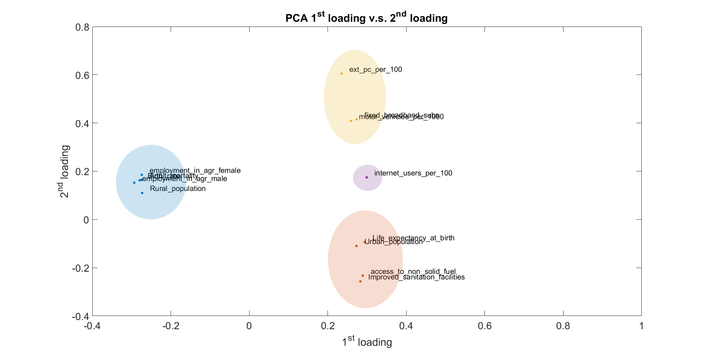

# Data Processing #
## 4 Clustering ##
In this phase of the processing part, we are going to try to cluster the countries and/or features with the aid of the `k-means` clustering algorithm. Therefore, we are going to look at the loading and score plots of the `PCA/PCR` and the `PLSR`. Note that we only look at the loadings and scores of the *reduced* X matrices. We use `k=3` in the k-means clustering, because we want to separate the countries by three degrees of happiness: *low*, *medium* and *high*. As a point of reference, list the sorted countries in **Table 3**, according to the clustering of our Y-vector, which is visualized as a histogram in **Figure 8**.  

 <b>Figure 8</b>: Happiness index vs. number of occurences: The data is divided into k=3 clusters denoting <i>low</i>,<i>medium</i> and <i>high</i> happiness. 
  

<table border="1" cellpadding="0" cellspacing="0">
<tbody>
<tr>
<td valign="top" >
<b>Low Happiness</b>
</td>
<td valign="top" >
<b>Medium Happiness</b>
</td>
<td valign="top" >
<b>High Happiness</b>
</td>
</tr>

<tr>
<td valign="top" >
'Afghanistan'
</td>
<td valign="top" >
'Azerbaijan'
</td>
<td valign="top" >
'Algeria'
</td>
</tr>

<tr>
<td valign="top" >
'Albania'
</td>
<td valign="top" >
'Belarus'
</td>
<td valign="top" >
'Argentina'
</td>
</tr>

<tr>
<td valign="top" >
'Angola'
</td>
<td valign="top" >
'Belize'
</td>
<td valign="top" >
'Australia'
</td>
</tr>

<tr>
<td valign="top" >
'Armenia'
</td>
<td valign="top" >
'Bhutan'
</td>
<td valign="top" >
'Austria'
</td>
</tr>

<tr>
<td valign="top" >
'Bangladesh'
</td>
<td valign="top" >
'Bolivia'
</td>
<td valign="top" >
'Bahrain'
</td>
</tr>

<tr>
<td valign="top" >
'Benin'
</td>
<td valign="top" >
'Bosnia and Herzegovina'
</td>
<td valign="top" >
'Belgium'
</td>
</tr>

<tr>
<td valign="top" >
'Botswana'
</td>
<td valign="top" >
'China'
</td>
<td valign="top" >
'Brazil'
</td>
</tr>

<tr>
<td valign="top" >
'Bulgaria'
</td>
<td valign="top" >
'Croatia'
</td>
<td valign="top" >
'Canada'
</td>
</tr>

<tr>
<td valign="top" >
'Burkina Faso'
</td>
<td valign="top" >
'Cyprus'
</td>
<td valign="top" >
'Chile'
</td>
</tr>

<tr>
<td valign="top" >
'Burundi'
</td>
<td valign="top" >
'Dominican Republic'
</td>
<td valign="top" >
'Colombia'
</td>
</tr>

<tr>
<td valign="top" >
'Cambodia'
</td>
<td valign="top" >
'Ecuador'
</td>
<td valign="top" >
'Costa Rica'
</td>
</tr>

<tr>
<td valign="top" >
'Cameroon'
</td>
<td valign="top" >
'El Salvador'
</td>
<td valign="top" >
'Czech Republic'
</td>
</tr>

<tr>
<td valign="top" >
'Chad'
</td>
<td valign="top" >
'Estonia'
</td>
<td valign="top" >
'Denmark'
</td>
</tr>

<tr>
<td valign="top" >
'Comoros'
</td>
<td valign="top" >
'Greece'
</td>
<td valign="top" >
'Finland'
</td>
</tr>

<tr>
<td valign="top" >
'Ethiopia'
</td>
<td valign="top" >
'Honduras'
</td>
<td valign="top" >
'France'
</td>
</tr>

<tr>
<td valign="top" >
'Gabon'
</td>
<td valign="top" >
'Hungary'
</td>
<td valign="top" >
'Germany'
</td>
</tr>

<tr>
<td valign="top" >
'Georgia'
</td>
<td valign="top" >
'Indonesia'
</td>
<td valign="top" >
'Guatemala'
</td>
</tr>

<tr>
<td valign="top" >
'Ghana'
</td>
<td valign="top" >
'Italy'
</td>
<td valign="top" >
'Iceland'
</td>
</tr>

<tr>
<td valign="top" >
'Guinea'
</td>
<td valign="top" >
'Jamaica'
</td>
<td valign="top" >
'Ireland'
</td>
</tr>

<tr>
<td valign="top" >
'Haiti'
</td>
<td valign="top" >
'Japan'
</td>
<td valign="top" >
'Israel'
</td>
</tr>

<tr>
<td valign="top" >
'India'
</td>
<td valign="top" >
'Jordan'
</td>
<td valign="top" >
'Kuwait'
</td>
</tr>

<tr>
<td valign="top" >
'Iraq'
</td>
<td valign="top" >
'Kazakhstan'
</td>
<td valign="top" >
'Luxembourg'
</td>
</tr>

<tr>
<td valign="top" >
'Kenya'
</td>
<td valign="top" >
'Latvia'
</td>
<td valign="top" >
'Malta'
</td>
</tr>

<tr>
<td valign="top" >
'Liberia'
</td>
<td valign="top" >
'Lebanon'
</td>
<td valign="top" >
'Mexico'
</td>
</tr>

<tr>
<td valign="top" >
'Madagascar'
</td>
<td valign="top" >
'Libya'
</td>
<td valign="top" >
'Netherlands'
</td>
</tr>

<tr>
<td valign="top" >
'Malawi'
</td>
<td valign="top" >
'Lithuania'
</td>
<td valign="top" >
'New Zealand'
</td>
</tr>

<tr>
<td valign="top" >
'Mali'
</td>
<td valign="top" >
'Malaysia'
</td>
<td valign="top" >
'Norway'
</td>
</tr>

<tr>
<td valign="top" >
'Mauritania'
</td>
<td valign="top" >
'Mauritius'
</td>
<td valign="top" >
'Panama'
</td>
</tr>

<tr>
<td valign="top" >
'Myanmar'
</td>
<td valign="top" >
'Moldova'
</td>
<td valign="top" >
'Puerto Rico'
</td>
</tr>

<tr>
<td valign="top" >
'Namibia'
</td>
<td valign="top" >
'Mongolia'
</td>
<td valign="top" >
'Qatar'
</td>
</tr>

<tr>
<td valign="top" >
'Niger'
</td>
<td valign="top" >
'Montenegro'
</td>
<td valign="top" >
'Saudi Arabia'
</td>
</tr>

<tr>
<td valign="top" >
'Rwanda'
</td>
<td valign="top" >
'Morocco'
</td>
<td valign="top" >
'Singapore'
</td>
</tr>

<tr>
<td valign="top" >
'Senegal'
</td>
<td valign="top" >
'Nepal'
</td>
<td valign="top" >
'Spain'
</td>
</tr>

<tr>
<td valign="top" >
'Sierra Leone'
</td>
<td valign="top" >
'Nicaragua'
</td>
<td valign="top" >
'Suriname'
</td>
</tr>

<tr>
<td valign="top" >
'South Africa'
</td>
<td valign="top" >
'Nigeria'
</td>
<td valign="top" >
'Sweden'
</td>
</tr>

<tr>
<td valign="top" >
'Sri Lanka'
</td>
<td valign="top" >
'Pakistan'
</td>
<td valign="top" >
'Switzerland'
</td>
</tr>

<tr>
<td valign="top" >
'Sudan'
</td>
<td valign="top" >
'Paraguay'
</td>
<td valign="top" >
'Thailand'
</td>
</tr>

<tr>
<td valign="top" >
'Tanzania'
</td>
<td valign="top" >
'Peru'
</td>
<td valign="top" >
'Trinidad and Tobago'
</td>
</tr>

<tr>
<td valign="top" >
'Togo'
</td>
<td valign="top" >
'Philippines'
</td>
<td valign="top" >
'United Arab Emirates'
</td>
</tr>

<tr>
<td valign="top" >
'Uganda'
</td>
<td valign="top" >
'Poland'
</td>
<td valign="top" >
'United Kingdom'
</td>
</tr>

<tr>
<td valign="top" >
'Ukraine'
</td>
<td valign="top" >
'Portugal'
</td>
<td valign="top" >
'United States'
</td>
</tr>

<tr>
<td valign="top" >
'Zimbabwe'
</td>
<td valign="top" >
'Romania'
</td>
<td valign="top" >
'Uruguay'
</td>
</tr>

<tr>
<td valign="top" > </td>
<td valign="top" >
'Serbia'
</td>
<td valign="top" > </td>
</tr>

<tr>
<td valign="top" > </td>
<td valign="top" >
'Slovenia'
</td>
<td valign="top" > </td>
</tr>

<tr>
<td valign="top" > </td>
<td valign="top" >
'Somalia'
</td>
<td valign="top" > </td>
</tr>

<tr>
<td valign="top" > </td>
<td valign="top" >
'Tajikistan'
</td>
<td valign="top" > </td>
</tr>

<tr>
<td valign="top" > </td>
<td valign="top" >
'Tunisia'
</td>
<td valign="top" > </td>
</tr>

<tr>
<td valign="top" > </td>
<td valign="top" >
'Turkey'
</td>
<td valign="top" > </td>
</tr>

<tr>
<td valign="top" > </td>
<td valign="top" >
'Turkmenistan'
</td>
<td valign="top" > </td>
</tr>

<tr>
<td valign="top" > </td>
<td valign="top" >
'Uzbekistan'
</td>
<td valign="top" > </td>
</tr>

<tr>
<td valign="top" > </td>
<td valign="top" >
'Vietnam'
</td>
<td valign="top" > </td>
</tr>

<tr>
<td valign="top" > </td>
<td valign="top" >
'Zambia'
</td>
<td valign="top" > </td>
</tr>

</tbody>
</table>

 
 <b>Table 3</b>: Countries sorted by Happiness score 

#### 4.2.1 PCA/PCR ####

We plot the first loading against the second loading in **Figure 9 (top)** and the first score against the second in **Figure 9 (bottom)**.

  
<b>Figure 9</b>: Top: PCA Loading plot (clustered), Bottom: PCA Score plot (clustered). 

We start by looking at the scores of the first two principal components. We take the first two, because they describe most of the variation. Looking at the scatter-plot in **Figure 9 (bottom)** it is apparent that the countries that have a similar happiness index also are located closely in the score plot. To further emphasize the relation between the countries, we perform a `k-means` cluster analysis with `k=3` clusters. The resulting clusters are enclosed in clouds with their respective color for better visualization. 
In the left part of the plot there is a gathering of predominantly *less developed countries* (mostly African countries), while most of the *first world countries* are represented in the right part of the plot (mostly European countries). When comparing the clusters to the entries of **Table 3**, one can interpret these clusters as the countries that represent **low** (yellow), **medium** (red) and **high** (blue) happiness. For instance, *Burundi* has a low happiness score and is located in the corresponding left-most cluster. *Azerbaijan* is a country with medium happiness according to the World Happiness Report and is therefore located in the middle. Lastly, most of the countries with high happiness fall into the right-most cluster (e.g. *Austria*). Some countries however don't fit in this scheme, which probably happens due to the fact that we use `k-means` clustering. This approach doesn't have any knowledge about the data, but splits the clusters in an algorithmic manner (for more details, please visit [Chapter 3: Methods](methods)).  
Another rather important observation we can make is that the points are mostly scattered far away from the origin. This means that these points are either outliers, or denote the extremes. This however coincides with the theory, that the location of the three clusters describes the three levels of happiness &mdash; a country with extremely low happiness would be located in the left cluster and a country with high happiness in the right cluster. 
For the second part of the cluster analysis, we also need the *loading* plot from **Figure 9 (top)**. If a point in this plot is close to the origin it means that it doesn't contribute as much to the variation of a variable and thus has a small "weight". Moreover, if multiple variables are strongly correlated they appear close to each other. If they are negatively correlated they appear diagonally opposite to each other. For this reason it makes sense to apply `k-means` clustering in order to find the correlated variables. We choose `k=4`, as this seems like a reasonable amount (by inspection). When comparing the direction of the samples from the score plot with the direction of the points from the loading plot, we see that the countries having a large value of a certain feature also tend to be aligned in the direction of this feature from the loading plot. For example, the *yellow* cluster from the score plot is strongly aligned in the direction of the *blue* cluster in the loading plot. The reason is that a lot of people from these countries are in fact occupied in the agricultural sector.  
As one can see we obtain a complete description of our data set by only looking at these two plots.

#### 4.2.2 PLSR ####
We plot the first loading against the second loading in **Figure 10 (top)** and the first score against the second score in **Figure 10 (bottom)**.

 
<b>Figure 10</b>: Top: PLS Loading plot (clustered), Bottom: PLS Score plot (clustered). 

Like in the `PCR`, from **Figure 10 (bottom)** one can see on the left the *less developed countries* (mostly African countries), while most of the *first world countries* are on the right part of the plots (mostly European countries). We perform `k-means` clustering and compare the results to the sorted countries in **Table 3**.
 While the extremes (left- and rightmost part of the plot) clearly contain the countries with low and high happiness respectively, the mid-range is strongly scattered. 
Since the `PLSR`-iteration from the [main processing](dp-mainprocessing) yields more remaining variables than in the `PCR` part, we can again look at the loading plot and look for certain dominant directions and clusters. First of all, the *unemployment rate (male and female)* appear very close to each other and are far away from the origin. We also know that unfortunately the unemployment rate in *Greece* is very high. As before, this fact can also be extracted from the plot: By mentally superimposing the loading and the score plot one sees that *Greece* lies in the same direction as the *unemployment rate (male/female)*. In addition to that, countries like *Austria*, *Germany* and *Switzerland* are aligned predominantly in the direction of a well-built infrastructure (cf. **Figure 10 (top)** *renewable internal freshwater*, *personal computers per 100 persons (ext\_pc\_per\_100)* and *access to electricity*). All of these countries have very good *access to electricity* (100% for all of these three countries), most of the population has *access to the internet* (unfortunately the text is not clearly visible but the *internet users (%)*-variable is also in the blue cluster. Austria: 81%, Germany: 86%, Switzerland: 87% ) and to *personal computers* ( Austria: 61% , Germany: 66% , Switzerland: 96%).

----------
Previous section: [Main Processing](dp-mainprocessing) 

Next chapter: [5. Results](results)