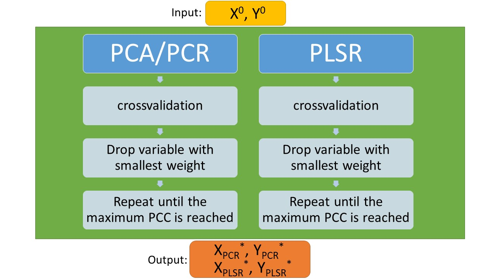

# Data Processing #

## 3 Main Processing ##
### 3.1 Workflow for main processing ###
From the pre-processing phase we obtained an X-matrix that spans 138 rows by 95 columns, but still contains a lot of `NaN` values. Therefore, before starting with the main processing, these missing values have to be replaced with the column mean or, in case there are more than 30 missing values for a single variable, discard the whole column.  
The outcome of this pre-processing step is an X-matrix with dimensions 138 rows by 67 columns. The objective now is to reduce the dimensionality of this matrix even further. We use various data analysis techniques to filter out only the most important variables. The workflow for doing so is visualized in **Figure 1**.  

   
<b>Figure 1</b>: Workflow for dimensionality reduction  

As we don't know a priori which of the methods yields the most optimal result with regards to accuracy *and* performance, we execute all of the necessary steps for both approaches (`PCA`/`PCR` and `PLSR`). As a measure of how well the output vector is approximated we used the **Pearson Correlation Coefficient** (or `PCC`).
The `PCC` is defined as:  

 , where `cov` is the covariance and `σ` the standard deviation. The value of the `PCC` can range from -1 to +1, with the plus sign denoting that Y grows linearly with X. In case of a negative `PCC` the Y would fall with increasing X. Either way, if the absolute value is large (i.e. close to |1|) it means that the correlation is high and therefore the scattering low. In our case we calculate the `PCC` between the fitted and the observed response (so X="fitted Y" and Y="observed Y" in the above equation).  
For this reason we want to find out at which point the `PCC` reaches its maximum, while discarding a variable in every iteration. So in every iteration, we discard the variable with the *smallest weight* and calculate the `PCC`. The outcome can be plotted and analyzed for a maximum. The corresponding X-value of the maximum gives us the amount of variables we can drop in order to preserve the maximum `PCC`.  
The exact procedure is described in the [next section](dp-pcr). The successive variable dropping is perform in the `MATLAB` script [drop_variables.m](../tree/master/scripts/complete_script/drop_variables.m). Then, further analysis using the `PCR` and the `PLSR` is performed in the script [process _and _plot](../tree/master/scripts/complete_script/prcoess_and_plot.m).

----------
Previous section: [Pre-Processing](dp-preprocessing) 

Next section: [PCR](dp-pcr)