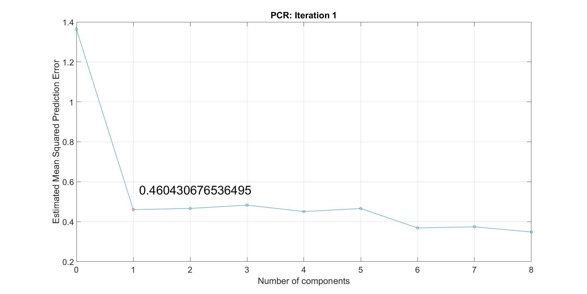
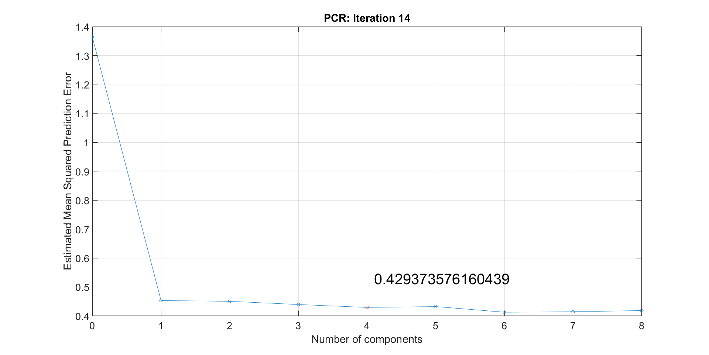
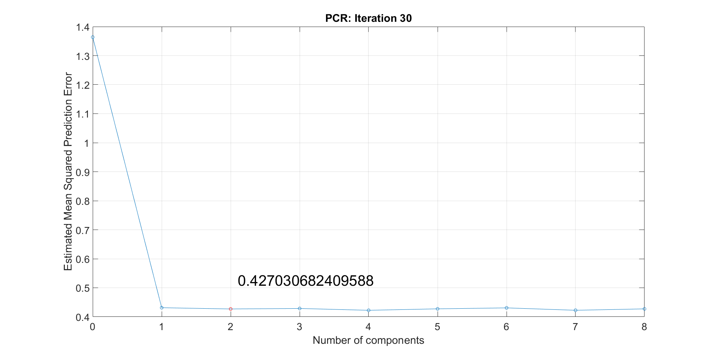
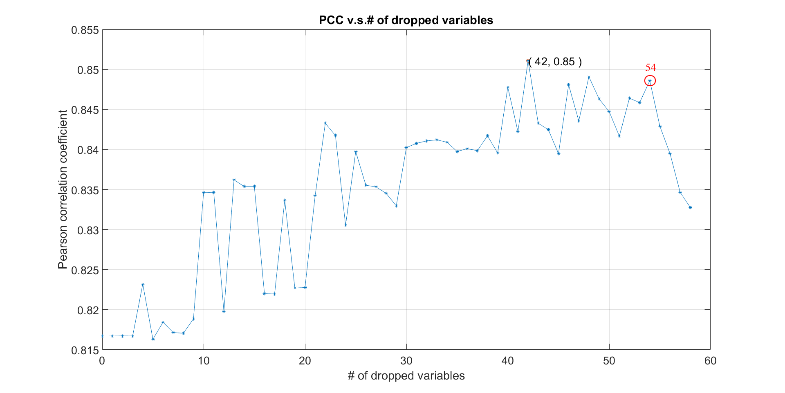
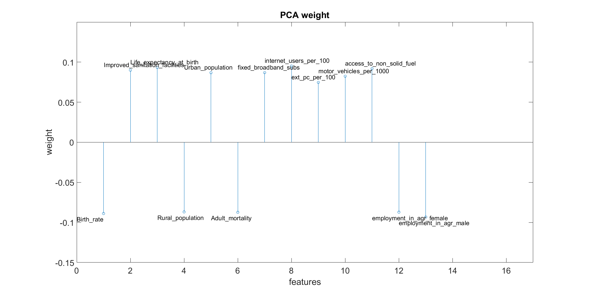

### 3.2 PCR ###
We discover the amount of necessary principal components by performing Leave-one-out cross-validation. We take the first local minimum in the "Estimated Mean Squared Prediction Error vs. Number of principle components" graph. Since this graph changes for every iteration &mdash; as we discard a variable in every step &mdash; the amount of principal components also changes. In **Figure 2** one can see estimated error plots for 3 randomly selected iteration. Notice that while the optimum amount of principal components varies slightly, the error fluctuation is very small. 

 
<b>Figure 2</b>: Measured Estimated Mean Squared Prediction Error for the iterations 1, 14 and 30 (PCR). 

In particular at the first iteration we have a prediction error of approximately 0.46, in the 14th it is 0.43 and in the 30th the prediction error is even less while using fewer principal components.  
The next plot we consider important for visualizing the performance of the `PCR` is the "Pearson Correlation Coeffictient" (`PCC`) over each iteration or equivalently, over the amount of discarded variables (since a variable gets dropped in every ieration). As mentioned in [section 3.1](dp-mainprocessing), the `PCC` measures how scattered the fitted response is with respect to the observed response. The `PCC` plot for the `PCR` is shown in **Figure 3**.

 
<b>Figure 3</b>: Pearson Correlation Coefficient over the amount of discarded variables. For the PCR we obtain the best results after dropping 54 variables. The PCC is approximately 0.85 in this case.  
 
We choose to drop 54 instead of 42 variables, because the `PCC` decreases rapidly after this point.
> Note: We have to modify the default `pcrsse` function of MATLAB to consider 8 instead of 10 principal components for Leave-one-out cross-validation. The reason for doing so is because we discard a variable in each iteration and if we keep the number of components at 10 we can only discard 50 variables. However, to illustrate the falling trend of the PCC that happens between the 50th and the 58th dropped variable, the number has to be reduced to 8. Otherwise the plot would only go until the 56th dropped variable.

The discarded and the remaining variables are listed in **Table 1**. 
  

<table border="1" cellpadding="0" cellspacing="0">
<tbody>
<tr>
<td valign="top" >
<b>Discared Features</b>
</td>
<td valign="top" >
<b>Remaining Features</b>
</td>
</tr>

<tr>
<td valign="top" >
1. 'Suicide_rates'
</td>
<td valign="top" >
1. Birth rate
</td>
</tr>

<tr>
<td valign="top" >
2. 'arable_land'
</td>
<td valign="top" >
2. Improved sanitation facilities (% of population with access)
</td>
</tr>

<tr>
<td valign="top" >
3. 'population_total'
</td>
<td valign="top" >
3. Life expectancy at birth, total (years)
</td>
</tr>

<tr>
<td valign="top" >
4. 'cash_surplus_deficit'
</td>
<td valign="top" >
4. Rural population (%)
</td>
</tr>

<tr>
<td valign="top" >
5. 'land_area'
</td>
<td valign="top" >
5. Urban population (%)
</td>
</tr>

<tr>
<td valign="top" >
6. 'economically_active_popul_in_agr'
</td>
<td valign="top" >
6. Adult mortality (per 1000 adults)
</td>
</tr>

<tr>
<td valign="top" >
7. 'unemployment_fem'
</td>
<td valign="top" >
7. Fixed broadband subscriptions (per 100 people)
</td>
</tr>

<tr>
<td valign="top" >
8. 'refugee_population_by_asyl'
</td>
<td valign="top" >
8. 'internet_users_per_100'
</td>
</tr>

<tr>
<td valign="top" >
9. 'Death_rate'
</td>
<td valign="top" >
9. 'ext_pc_per_100'
</td>
</tr>

<tr>
<td valign="top" >
10. 'military_expenditure'
</td>
<td valign="top" >
10. 'motor_vehicles_per_1000'
</td>
</tr>

<tr>
<td valign="top" >
11. 'gender_parity'
</td>
<td valign="top" >
11. 'access_to_non_solid_fuel'
</td>
</tr>

<tr>
<td valign="top" >
12. 'armed_forces_total'
</td>
<td valign="top" >
12. 'employment_in_agr_female'
</td>
</tr>

<tr>
<td valign="top" >
13. 'net_income_bop'
</td>
<td valign="top" >
13. 'employment_in_agr_male'
</td>
</tr>

<tr>
<td valign="top" >
14. 'population_density'
</td>
<td valign="top" > </td>
</tr>

<tr>
<td valign="top" >
15. 'forest_area'
</td>
<td valign="top" > </td>
</tr>

<tr>
<td valign="top" >
16. 'Immunization_measles'
</td>
<td valign="top" > </td>
</tr>

<tr>
<td valign="top" >
17. 'gdp_growth'
</td>
<td valign="top" > </td>
</tr>

<tr>
<td valign="top" >
18. 'renewable_internal_freshwater'
</td>
<td valign="top" > </td>
</tr>

<tr>
<td valign="top" >
19. 'unemployment_male'
</td>
<td valign="top" > </td>
</tr>

<tr>
<td valign="top" >
20. 'time_to_prepare_pay_taxes'
</td>
<td valign="top" > </td>
</tr>

<tr>
<td valign="top" >
21. 'total_greenhouse_gas_emission'
</td>
<td valign="top" > </td>
</tr>

<tr>
<td valign="top" >
22. 'co2_emission_kt'
</td>
<td valign="top" > </td>
</tr>

<tr>
<td valign="top" >
23. 'youth_literacy_rate'
</td>
<td valign="top" > </td>
</tr>

<tr>
<td valign="top" >
24. 'Population_growth'
</td>
<td valign="top" > </td>
</tr>

<tr>
<td valign="top" >
25. 'Homicide'
</td>
<td valign="top" > </td>
</tr>

<tr>
<td valign="top" >
26. 'ext_int_tourism_number_arriv'
</td>
<td valign="top" > </td>
</tr>

<tr>
<td valign="top" >
27. 'refugee_population_by_origin'
</td>
<td valign="top" > </td>
</tr>

<tr>
<td valign="top" >
28. 'agricultural_land'
</td>
<td valign="top" > </td>
</tr>

<tr>
<td valign="top" >
29. 'gdp_at_market_price'
</td>
<td valign="top" > </td>
</tr>

<tr>
<td valign="top" >
30. 'agr_methane_emission'
</td>
<td valign="top" > </td>
</tr>

<tr>
<td valign="top" >
31. 'total_roads_km'
</td>
<td valign="top" > </td>
</tr>

<tr>
<td valign="top" >
32. 'Immunization_DPT'
</td>
<td valign="top" > </td>
</tr>

<tr>
<td valign="top" >
33. 'road_density_per_km'
</td>
<td valign="top" > </td>
</tr>

<tr>
<td valign="top" >
34. 'gov_expenditure_on_edu'
</td>
<td valign="top" > </td>
</tr>

<tr>
<td valign="top" >
35. 'primary_completion_rate'
</td>
<td valign="top" > </td>
</tr>

<tr>
<td valign="top" >
36. 'Alcohol_per_capita_consumption'
</td>
<td valign="top" > </td>
</tr>

<tr>
<td valign="top" >
37. 'inflation_consumer_prices'
</td>
<td valign="top" > </td>
</tr>

<tr>
<td valign="top" >
38. 'population_urban_agglo'
</td>
<td valign="top" > </td>
</tr>

<tr>
<td valign="top" >
39. 'Age_dependency_ratio'
</td>
<td valign="top" > </td>
</tr>

<tr>
<td valign="top" >
40. 'agr_nitr_oxide_emission'
</td>
<td valign="top" > </td>
</tr>

<tr>
<td valign="top" >
41. 'terr_prot_areas'
</td>
<td valign="top" > </td>
</tr>

<tr>
<td valign="top" >
42. 'Obesity'
</td>
<td valign="top" > </td>
</tr>

<tr>
<td valign="top" >
43. 'Fertility_rate'
</td>
<td valign="top" > </td>
</tr>

<tr>
<td valign="top" >
44. 'Incidence_of_tuberculosis'
</td>
<td valign="top" > </td>
</tr>

<tr>
<td valign="top" >
45. 'access_to_electricity'
</td>
<td valign="top" > </td>
</tr>

<tr>
<td valign="top" >
46. 'net_migration'
</td>
<td valign="top" > </td>
</tr>

<tr>
<td valign="top" >
47. 'Improved_water_source'
</td>
<td valign="top" > </td>
</tr>

<tr>
<td valign="top" >
48. 'goods_exports'
</td>
<td valign="top" > </td>
</tr>

<tr>
<td valign="top" >
49. 'Mortality_rate_under5'
</td>
<td valign="top" > </td>
</tr>

<tr>
<td valign="top" >
50. 'Health_expenditure_total'
</td>
<td valign="top" > </td>
</tr>

<tr>
<td valign="top" >
51. 'Health_expenditure_public'
</td>
<td valign="top" > </td>
</tr>

<tr>
<td valign="top" >
52. 'Mortality_caused_by_road_traffic_injury'
</td>
<td valign="top" > </td>
</tr>

<tr>
<td valign="top" >
53. 'improved_sanit_facil'
</td>
<td valign="top" > </td>
</tr>

<tr>
<td valign="top" >
54. 'agriculture_value'
</td>
<td valign="top" > </td>
</tr>

</tbody>
</table>

 <b>Table 1</b>: List of all the 54 discarded and 13 remaining features.

 
The final weights that result from the `PCR` are visualized in a stem-plot, cf. **Figure 4**.

 
<b>Figure 4</b>: PCR weights of for the remaining 13 features. 

----------
Previous section: [Workflow](dp-mainrocessing) 

Next section: [PLSR](dp-plsr)