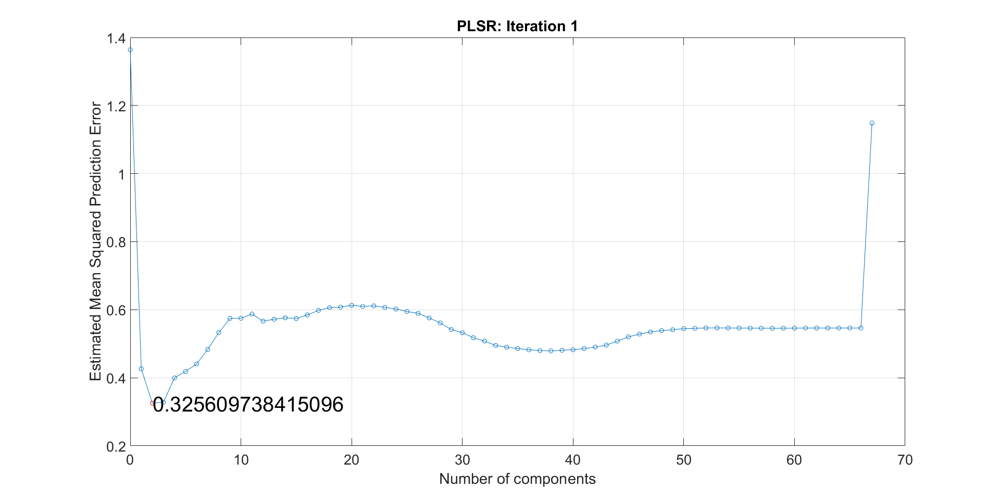
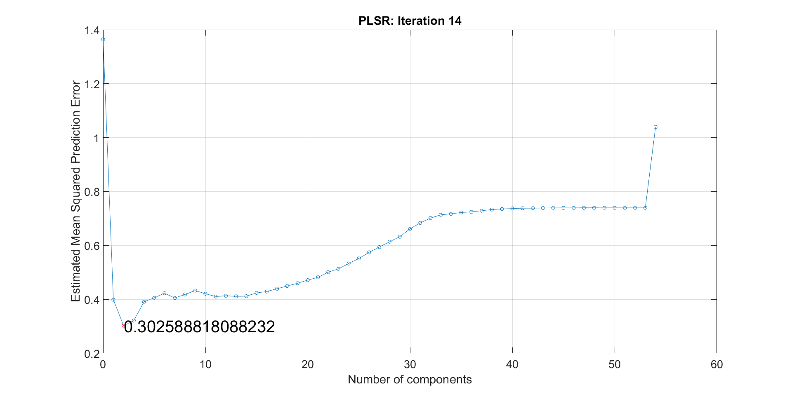
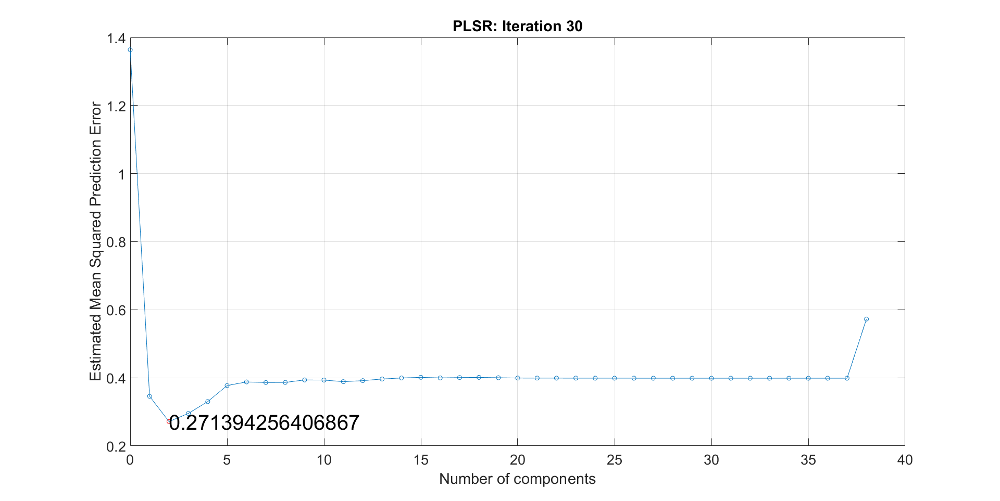
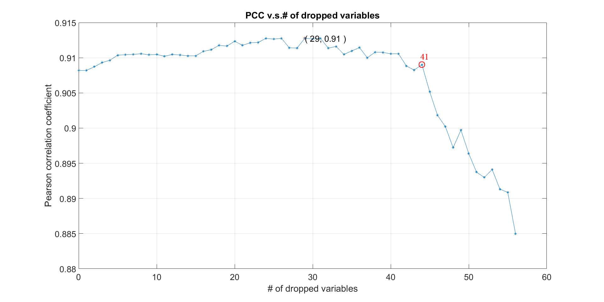
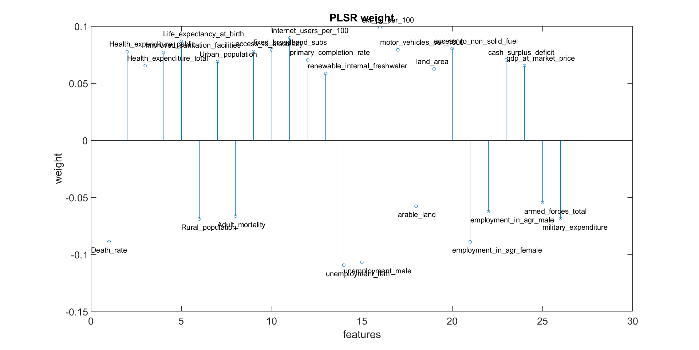

### 3.3 PLSR ###
Similarly to the `PCR` we also perform a Leave-one-out cross-validation in the `PLSR` for finding the right amount of principal components in every iteration. For comparison, we show the estimated mean squared prediction error over the number of principle components in **Figure 5**, using the same iteration indices as in the `PCR` (1,14 and 30).
 

  
<b>Figure 5</b>:Measured Estimated Mean Squared Prediction Error for the iterations 1, 14 and 30 (PLSR).  

Two main differences can be observed when comparing the plots in **Figure 4** with the plots in **Figure 5**: The value of the estimated prediction error is smaller and the optimal amount of principal components stays 2 for all iterations (also the ones not shown here).In the `PCR` the optimal amount of principal components seems to change randomly with each iteration, although it remains below 5. 
 The `PCC` is also plotted in **Figure 6**:

 <b>Figure 6</b>: Pearson Correlation Coefficient over the amount of discarded variables. For the PLSR we obtain the best results after dropping 41 variables. However the PCC is approximately 0.91 in this case.

It can be seen from the plot that this time we can only drop 41 instead of 54 variables. The reason for choosing 41 over 29 is that from the 41st dropped variable on the `PCC` seems to be almost monotonically decreasing. At 29 dropped variables it still stays at approximately the same level without decreasing too much in value. The approximation of the `PLSR` is at `PCC=0.91`. Consequently there is a trade-off between how *accurate* the response is approximated and how *efficient* it is implemented. In the [next part](results), we are going to discuss how both approximations perform in a test set to see which of the methods is better suited for our application.  
The discarded and remaining countries are again listed in a table, cf. **Table 2**:
    

<table border="1" cellpadding="0" cellspacing="0">
<tbody>
<tr>
<td valign="top" >
<b>Discared Features </b>
</td>
<td valign="top" >
<b>Remaining Features</b>
</td>
</tr>

<tr>
<td valign="top" >
1. 'Suicide_rates'
</td>
<td valign="top" >
1. 'Death_rate'
</td>
</tr>

<tr>
<td valign="top" >
2. 'Improved_water_source'
</td>
<td valign="top" >
2. 'Health_expenditure_public'
</td>
</tr>

<tr>
<td valign="top" >
3. 'gender_parity'
</td>
<td valign="top" >
3. 'Health_expenditure_total'
</td>
</tr>

<tr>
<td valign="top" >
4. 'Immunization_measles'
</td>
<td valign="top" >
4. 'Improved_sanitation_facilities'
</td>
</tr>

<tr>
<td valign="top" >
5. 'youth_literacy_rate'
</td>
<td valign="top" >
5. 'Life_expectancy_at_birth'
</td>
</tr>

<tr>
<td valign="top" >
6. 'Immunization_DPT'
</td>
<td valign="top" >
6. 'Rural_population'
</td>
</tr>

<tr>
<td valign="top" >
7. 'total_roads_km'
</td>
<td valign="top" >
7. 'Urban_population'
</td>
</tr>

<tr>
<td valign="top" >
8. 'road_density_per_km'
</td>
<td valign="top" >
8. 'Adult_mortality'
</td>
</tr>

<tr>
<td valign="top" >
9. 'population_density'
</td>
<td valign="top" >
9. 'access_to_electricity'
</td>
</tr>

<tr>
<td valign="top" >
10. 'time_to_prepare_pay_taxes'
</td>
<td valign="top" >
10. 'fixed_broadband_subs'
</td>
</tr>

<tr>
<td valign="top" >
11. 'gdp_growth'
</td>
<td valign="top" >
11. 'internet_users_per_100'
</td>
</tr>

<tr>
<td valign="top" >
12. 'total_greenhouse_gas_emission'
</td>
<td valign="top" >
12. 'primary_completion_rate'
</td>
</tr>

<tr>
<td valign="top" >
13. 'co2_emission_kt'
</td>
<td valign="top" >
13. 'renewable_internal_freshwater'
</td>
</tr>

<tr>
<td valign="top" >
14. 'ext_int_tourism_number_arriv'
</td>
<td valign="top" >
14. 'unemployment_fem'
</td>
</tr>

<tr>
<td valign="top" >
15. 'population_total'
</td>
<td valign="top" >
15. 'unemployment_male'
</td>
</tr>

<tr>
<td valign="top" >
16. 'Fertility_rate'
</td>
<td valign="top" >
16. 'ext_pc_per_100'
</td>
</tr>

<tr>
<td valign="top" >
17. 'net_migration'
</td>
<td valign="top" >
17. 'motor_vehicles_per_1000'
</td>
</tr>

<tr>
<td valign="top" >
18. 'agriculture_value'
</td>
<td valign="top" >
18. 'arable_land'
</td>
</tr>

<tr>
<td valign="top" >
19. 'Alcohol_per_capita_consumption'
</td>
<td valign="top" >
19. 'land_area'
</td>
</tr>

<tr>
<td valign="top" >
20. 'Age_dependency_ratio'
</td>
<td valign="top" >
20. 'access_to_non_solid_fuel'
</td>
</tr>

<tr>
<td valign="top" >
21. 'economically_active_popul_in_agr'
</td>
<td valign="top" >
21. 'employment_in_agr_female'
</td>
</tr>

<tr>
<td valign="top" >
22. 'forest_area'
</td>
<td valign="top" >
22. 'employment_in_agr_male'
</td>
</tr>

<tr>
<td valign="top" >
23. 'inflation_consumer_prices'
</td>
<td valign="top" >
23. 'cash_surplus_deficit'
</td>
</tr>

<tr>
<td valign="top" >
24. 'Birth_rate'
</td>
<td valign="top" >
24. 'gdp_at_market_price'
</td>
</tr>

<tr>
<td valign="top" >
25. 'Population_growth'
</td>
<td valign="top" >
25. 'armed_forces_total'
</td>
</tr>

<tr>
<td valign="top" >
26. 'population_urban_agglo'
</td>
<td valign="top" >
26. 'military_expenditure'
</td>
</tr>

<tr>
<td valign="top" >
27. 'agr_nitr_oxide_emission'
</td>
<td valign="top" > </td>
</tr>

<tr>
<td valign="top" >
28. 'refugee_population_by_origin'
</td>
<td valign="top" > </td>
</tr>

<tr>
<td valign="top" >
29. 'Mortality_rate_under5'
</td>
<td valign="top" > </td>
</tr>

<tr>
<td valign="top" >
30. 'gov_expenditure_on_edu'
</td>
<td valign="top" > </td>
</tr>

<tr>
<td valign="top" >
31. 'goods_exports'
</td>
<td valign="top" > </td>
</tr>

<tr>
<td valign="top" >
32. 'net_income_bop'
</td>
<td valign="top" > </td>
</tr>

<tr>
<td valign="top" >
33. 'refugee_population_by_asyl'
</td>
<td valign="top" > </td>
</tr>

<tr>
<td valign="top" >
34. 'Homicide'
</td>
<td valign="top" > </td>
</tr>

<tr>
<td valign="top" >
35. 'Obesity'
</td>
<td valign="top" > </td>
</tr>

<tr>
<td valign="top" >
36. 'terr_prot_areas'
</td>
<td valign="top" > </td>
</tr>

<tr>
<td valign="top" >
37. 'agr_methane_emission'
</td>
<td valign="top" > </td>
</tr>

<tr>
<td valign="top" >
38. 'agricultural_land'
</td>
<td valign="top" > </td>
</tr>

<tr>
<td valign="top" >
39. 'Mortality_caused_by_road_traffic_injury'
</td>
<td valign="top" > </td>
</tr>

<tr>
<td valign="top" >
40. 'Incidence_of_tuberculosis'
</td>
<td valign="top" > </td>
</tr>

<tr>
<td valign="top" >
41. 'improved_sanit_facil'
</td>
<td valign="top" > </td>
</tr>

</tbody>
</table>

 <b>Table 2</b>: List of all the 41 discarded and 26 remaining features.

 
The corresponding weights of the 26 remaining features are again plotted in **Figure 7**:

 
<b>Figure 7</b>: PLSR weights of for the remaining 26 features. 

----------
Previous section: [PCR](dp-pcr) 

Next section: [Clustering](dp-clustering)