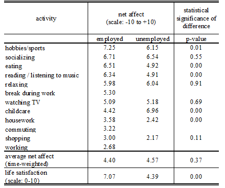

# Research #

## 1 Introduction ##
In this final chapter of our Wiki we want to take the opportunity to interpret the results we have gotten from our analysis. In the first part of this chapter we are going to look at the results from the `PCR`-driven approach. We focus mainly on the resulting *weights* considering their sign and their magnitude. In the second part we do the same thing for the `PLSR`-driven approach. We try to prove the significance of the features for life satisfaction using scientific evidence. 

## 2. PCR Results ##
We first of all want to remind the reader of the remaining variables using this approach. For this purpose, please consider **Table 4** below:  

<table border="1" cellpadding="0" cellspacing="0">
<tbody>
<tr>
<td valign="top" >
<b>Sector</b>
</td>
<td valign="top" >
<b>Remaining Features</b>
</td>
<td valign="top" >
<b>Weight</b>
</td>
</tr>

<tr>
<td rowspan="2" valign="top" >
Health
</td>
<td valign="top" >
1. Birth rate
</td>
<td valign="top" >
<b>-0.0888</b>
</td>
</tr>

<tr>
<td valign="top" >
2. Life expectancy at birth, total (years)
</td>
<td valign="top" >
<b>0.0934</b>
</td>
</tr>

<tr>
<td rowspan="9" valign="top" >
Infrastructure and Social Development
</td>
<td valign="top" >
3. Improved sanitation facilities (% of population with access)
</td>
<td valign="top" >
<b>0.0900</b>
</td>
</tr>

<tr>
<td valign="top" >
4. Rural population (%)
</td>
<td valign="top" >
<b>-0.0868</b>
</td>
</tr>

<tr>
<td valign="top" >
5. Urban population (%)
</td>
<td valign="top" >
<b>0.0868</b>
</td>
</tr>

<tr>
<td valign="top" >
6. Adult mortality (per 1000 adults)
</td>
<td valign="top" >
<b>-0.0873</b>
</td>
</tr>

<tr>
<td valign="top" >
7. Fixed broadband subscriptions (per 100 people)
</td>
<td valign="top" >
<b>0.0869</b>
</td>
</tr>

<tr>
<td valign="top" >
8. Internet users (%)
</td>
<td valign="top" >
<b>0.0951</b>
</td>
</tr>

<tr>
<td valign="top" >
9. Personal computers (per 100 people)
</td>
<td valign="top" >
<b>0.0747</b>
</td>
</tr>

<tr>
<td valign="top" >
10. Motor vehicles (per 1000 people)
</td>
<td valign="top" >
<b>0.0824</b>
</td>
</tr>

<tr>
<td valign="top" >
11. Access to non-solid fuel (% of population)
</td>
<td valign="top" >
<b>0.0920</b>
</td>
</tr>

<tr>
<td rowspan="2" valign="top" >
Agriculture and Environment
</td>
<td valign="top" >
12. Employment in agriculture, female (% of female employment)
</td>
<td valign="top" >
<b>-0.0872</b>
</td>
</tr>

<tr>
<td valign="top" >
13. Employment in agriculture, male (% of male employment)
</td>
<td valign="top" >
<b>-0.0933</b>
</td>
</tr>

</tbody>
</table>

 
<b>Table 4</b>: Final PCR weights of the features. 

*Health*:  To our surprise the **Birth rate** has a negative weight, meaning it is negatively correlated with happiness. As we cannot explain this behavior for European countries. In an [article](https://www.lifesitenews.com/news/italian-birth-rate-continues-to-sink-and-drag-down-italian-life-satisfactio) by Hilary White published in 2013, it has been analyzed that the below-average happiness index of Italy (below average compared to the OECD average happiness score which is 6.6 and Italy scores at 5.9) is probably correlated with the **low** birth rate. On the other hand, in non-OECD countries where the happiness score is very low (e.g. *Burundi*, *Chad*, *Sierra Leone*) the birth rate is also very high (which can be easily seen by looking at the [loadings and scores](clustering)). Since these non-OECD countries are far more than the OECD countries, it makes sense that the results are inverted from what we expected.   
On the other hand it is no surprise that **life expectancy at birth** has a high, positive weight (0.0934).  
*Infrastructure and Social Development* :   Most of the variables come from this sector. A good infrastructure (like for example **improved sanitation facilities**,**access to electricity/non-solid fuel and internet**) brings comforts that tend to make people's lives easier.  The distribution of the population among **rural and urban regions** seems to have a high discrepancy with regards to life satisfaction. Again, our intuition says that happiness should be higher in rural areas, since there aren't as many vehicles as in the cities (and consequently less noise) and the air pollution is also lower. On the other hand, due to the fact that global urbanization is rapidly growing, the majority of the jobs are also available in urban areas (cf. [World Urbanization Prospect](http://www.un.org/en/development/desa/news/population/world-urbanization-prospects-2014.html) by the United Nations). As we will see later in the research, employment plays a crucial role in the degree of happiness. 
According to WHO, **adult mortality** "represents the probability that a 15 year old person will die before reaching his/her 60th birthday". While adult mortality is low in the Western countries, it is significantly higher in the African region (cf. Adult mortality rate, 1990–2013 by the [World Health Organization](http://www.who.int/gho/mortality_burden_disease/mortality_adult/situation_trends_text/en/)). As the happiness scores in these countries are very low it is apparent that adult mortality has a negative weight.  
*Agriculture and Environment*:  
 Only two features are left in this category, i.e the **female and male employment in agriculture**. The loading and score plot from the [clustering](clustering) part of our Wiki shows that the countries with low happiness tend to have high occupation in the agricultural sector. A reason for the negative weights could be that the agricultural employment is very different in countries where the happiness is high (as in Denmark for example) compared to countries where the happiness is low (Burundi). The agricultural sector in these countries isn't as technologically developed as for example in Europe, so most of the work is done manually and not by machines. Unfortunately a lot of children have to work as well in this sector to provide for their families (cf. [International Labour Organization](http://www.ilo.org/ipec/areas/Agriculture/WCMS_172261/lang--en/index.htm)).

## 3. PLSR Results ##
The remaining variables from the `PLSR` analysis are shown in **Table 5**.  

<table border="1" cellpadding="0" cellspacing="0">
<tbody>
<tr>
<td valign="top" >
<b>Sector</b>
</td>
<td valign="top" >
<b>Remaining Features</b>
</td>
<td valign="top" >
<b>Weight</b>
</td>
</tr>

<tr>
<td rowspan="5" valign="top" >
Health
</td>
<td valign="top" >
1. Death rate
</td>
<td valign="top" >
<b>-0.0887</b>
</td>
</tr>

<tr>
<td valign="top" >
2. Health expenditure, public (% of GDP)
</td>
<td valign="top" >
<b>0.0776</b>
</td>
</tr>

<tr>
<td valign="top" >
3. Health expenditure, total (% of GDP)
</td>
<td valign="top" >
<b>0.0654</b>
</td>
</tr>

<tr>
<td valign="top" >
4. Life expectancy at birth, total (years)
</td>
<td valign="top" >
<b>0.0866</b>
</td>
</tr>

<tr>
<td valign="top" >
5. Adult mortality (per 1000 adults)
</td>
<td valign="top" >
<b>-0.0664</b>
</td>
</tr>

<tr>
<td rowspan="13" valign="top" >
Infrastructure and Social Development
</td>
<td valign="top" >
6. Improved sanitation facilities (% of population with access)
</td>
<td valign="top" >
<b>0.0769</b>
</td>
</tr>

<tr>
<td valign="top" >
7. Rural population (%)
</td>
<td valign="top" >
<b>-0.0689</b>
</td>
</tr>

<tr>
<td valign="top" >
8. Urban population (%)
</td>
<td valign="top" >
<b>0.0689</b>
</td>
</tr>

<tr>
<td valign="top" >
9. Access to electricity (% of population)
</td>
<td valign="top" >
<b>0.0779</b>
</td>
</tr>

<tr>
<td valign="top" >
10. Fixed broadband subscriptions (per 100 people)
</td>
<td valign="top" >
<b>0.0792</b>
</td>
</tr>

<tr>
<td valign="top" >
11. Internet users (%)
</td>
<td valign="top" >
<b>0.0897</b>
</td>
</tr>

<tr>
<td valign="top" >
12. Primary completion rate, total (% of relevant age group)
</td>
<td valign="top" >
<b>0.0704</b>
</td>
</tr>

<tr>
<td valign="top" >
13. Renewable internal freshwater resources (cubic meters)
</td>
<td valign="top" >
<b>0.0585</b>
</td>
</tr>

<tr>
<td valign="top" >
14. Unemployment, female (% of female labor force)
</td>
<td valign="top" >
<b>-0.1094</b>
</td>
</tr>

<tr>
<td valign="top" >
15. Unemployment, male (% of female labor force)
</td>
<td valign="top" >
<b>-0.1069</b>
</td>
</tr>

<tr>
<td valign="top" >
16. Personal computers (per 100 people)
</td>
<td valign="top" >
<b>0.0988</b>
</td>
</tr>

<tr>
<td valign="top" >
17. Motor vehicles (per 1000 people)
</td>
<td valign="top" >
<b>0.0792</b>
</td>
</tr>

<tr>
<td valign="top" >
18. Access to non-solid fuel (% of population)
</td>
<td valign="top" >
<b>0.0804</b>
</td>
</tr>

<tr>
<td rowspan="4" valign="top" >
Agriculture and Environment
</td>
<td valign="top" >
19. Arable land (% of land area)
</td>
<td valign="top" >
<b>-0.0577</b>
</td>
</tr>

<tr>
<td valign="top" >
20. Land area (sq. km)
</td>
<td valign="top" >
<b>0.0625</b>
</td>
</tr>

<tr>
<td valign="top" >
21. Employment in agriculture, female (% of female employment)
</td>
<td valign="top" >
<b>-0.0890</b>
</td>
</tr>

<tr>
<td valign="top" >
22. Employment in agriculture, male (% of male employment)
</td>
<td valign="top" >
<b>-0.0625</b>
</td>
</tr>

<tr>
<td rowspan="2" valign="top" >
Finance
</td>
<td valign="top" >
23. Cash surplus/deficit (% of GDP)
</td>
<td valign="top" >
<b>0.0704</b>
</td>
</tr>

<tr>
<td valign="top" >
24. GDP at market prices (current US$)

</td>
<td valign="top" >
<b>0.0653</b>
</td>
</tr>

<tr>
<td rowspan="2" valign="top" > </td>
<td valign="top" >
25. Armed forces personnel (% of total labor force)
</td>
<td valign="top" >
<b>-0.0547</b>
</td>
</tr>

<tr>
<td valign="top" >
26. Military expenditure (% of GDP)
</td>
<td valign="top" >
<b>-0.0688</b>
</td>
</tr>

</tbody>
</table>

<b>Table 5</b>: Final PLSR weights of the features. 

As one can see a lot of features are common to the ones from the `PCR` analysis. Now also the Finance sector comes into play, however with fairly low absolute weight values when compared to the other sectors (which comes to our surprise, as we thought that a good finance is tightly coupled to the well-being of the people in a particular country).  
*Health*:  
From the `PLSR` it turns out that the **death rate** also plays a significant role in life satisfaction. The weight is negative as we expected. **Health expenditure** is also an important factor. If a country is using its financial resource to support the health system it turns out that this has a positive impact on the satisfaction of the people (cf. [Happiness And Health](http://content.healthaffairs.org/content/27/1/72.full) by Carol Graham).   
*Infrastructure and Social Development*:  
Like before a lot of the features that correspond to a good infrastructure in a country (access to electricity, internet, freshwater, etc.) also get positive weights in the `PLSR` analysis. This time, it seems like the comfort is even more important than the basic human needs, as the weights of **Internet users, personal computers (per 1000 people)** are larger than the weights of **Improved sanitation facilities, access to electricity or freshwater**. The **access to non-solid fuels** is fairly high and this has several reasons. As has been revealed in a [report from the World Bank](http://documents.worldbank.org/curated/en/867331468331258971/Tracking-access-to-nonsolid-fuel-for-cooking;jsessionid=yqEsWWGuBZ28eaMCaGat3nEj), the lack of nonsolid fuels can have detrimental effects for households. People try to cook using fuels like wood or coal, which exposes the households to high air pollution and leads to a risk of house burns or health. The WHO estimates that the use of inefficient fuels causes **4 million deaths per year** (cf. [Access to non-solid fuel](http://energyeducation.ca/encyclopedia/Access_to_non-solid_fuel) by Jordan Hanania et al. ).  
 Another important factor that is new is the **primary completion rate**. This factor is defined as the percentage of students completing the last year of primary school (as can be read in [this article](http://www.wikigender.org/wiki/primary-completion-rates/)). Therefore, a minimum degree of education is necessary for a happy life, as it is easier to find a better profession when a person has some minimum ability to read and/or write. This leads us to the next variables, that we think are the most important ones according to their weights, i.e.: **unemployment (female and male)**. Looking more closely at the values of these two unemployment rates, we see that they are both about equally important. The same can be observed in the `PCR`, by the way. This leads to the conclusion that not only the male, but also the *female* employment is important to ensure a happy society.   
*Agriculture and Environment*:  
Despite the employment in agriculture, also the **arable land** and the **land area** are added to the most important features. The arable land is a "land capable of being ploughed and used to grow crops", according to [the definition](https://en.wikipedia.org/wiki/Arable_land). In countries that have a lot of arable land area the employment in the agricultural sector is accordingly large. As we have seen mainly African regions are comprised in this set of countries which have a low happiness index. The land area on the other hand describes the total area of a country. According to its weight from **Table 5** the larger countries should be the happier ones (note that Russia is not included in the the World Happiness Report).  
To our surprise, none of the environmental data (like air/water pollution) is represented in this table.   
*Finance*: 
The features with positive weights are the **Cash surplus/deficit** and the **GDP at market prices (US$)**. Both of these variables describe how much money a country has either in excess (cash surplus) or in form of all final goods/services produces (GDP). This proves that money is important to some degree for happiness. The absolute weights of these two features are on the lower end however. The last two variables, **armed forces personnel** and **military expenditure** also have negative weights for obvious reasons: countries that need a lot of armed forces tend to be more involved in wars (like *Iraq* for example which also has a low happiness score of only 4.5!). 

## Further Research ##
Of course, the reason behind the significance of unemployment can be analyzed even further in order to find the root causes. However, due to the time constraints we want to refer to the research done by [Knabe et. al in 2010](https://ideas.repec.org/p/ces/ceswps/_2604.html) in Germany. In his research he asked 600 employed and unemployed persons to construct a diary of all the activities they performed in the preceding day. They then got a list of negative and positive feelings and they had to associate these feelings with the activities they performed and give them a score of zero (0: not satisfied) to ten (10: very satisfied). The net affect, which was calculated by the difference of the average score of negative feelings and the average score of positive feelings is seen in the table below:

</img>

It can be seen that life satisfaction is much higher for employed people.

----------
Previous chapter: [5. Results](results) 

Next chapter: [7. Conclusion](conclusion)