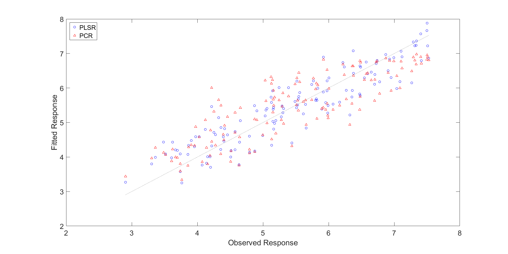
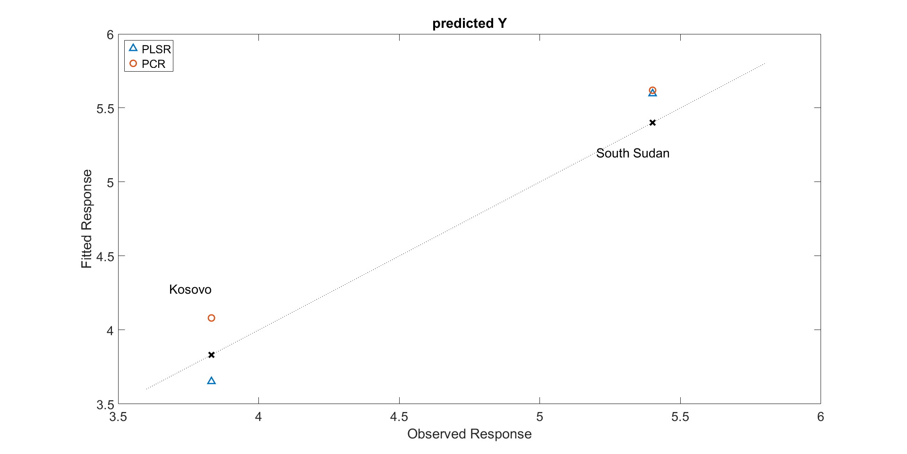
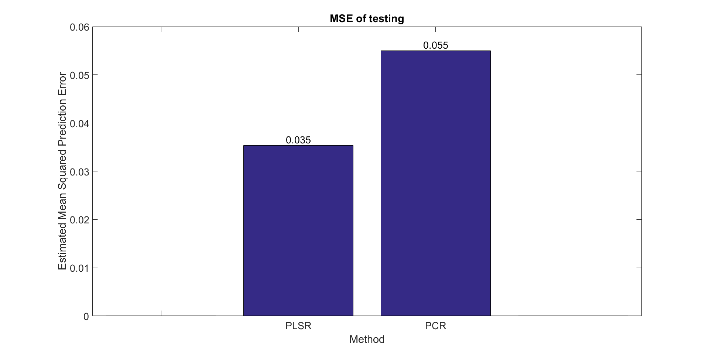

# Results #

## 1 Introduction ##
In this part of our Wiki, we present the results of our data analysis. Section 2 contains the fitted responses of both approaches. In section 3 we use the derived models from the `PCR` and `PLSR` to predict the happiness of some test countries. We conclude this part with a comparison between the `PCR` and `PLSR`.

## 2 Comparison of fitted and observed response ##
In **Figure 10** one sees the fitted response of the `PCR` (red triangles) and the `PLSR` (blue circles). From this plot we cannot draw a conclusion yet which model is better suited for our application. 

 
<b>Figure 10</b>: PLS Scores plot. Top: Unclustered, Bottom: Clustered. 

## 3 Testing phase ##
### 3.1 Clean-up "not found" data ###
Before predicting the happiness index, our "dummies" have to be prepared, i.e. the `NaN` values have to be cleaned. Since most of the `NaN` values have been eliminated in the pre-processing phase of our analysis, the only thing left to do is replace the remaining missing values with the column mean. The samples we want to predict the happiness score for are *Kosovo* and *South Sudan*. The reason we use these countries is that we already have a reference happiness index for them, but couldn't include them in training as they had too many missing values. After discarding more and more variables in the [main processing](data-processing) phase, most of the remaining variables are also existent in these two countries.
### 3.2 Prediction of happiness score ###
It's time to compare the `PCR` and `PLSR`-based approaches with regards to their predictive ability. The tests are performed in a `MATLAB` script called [Test_Y.m](../tree/master/scripts/complete_script/TesttingY/Test_Y.m)). We predict the happiness score of two countries using the respective models. The outcome of the test phase can be seen in **Figure 11**.

  
<b>Figure 11</b>: Top: Predicted happiness indices for <i>Kosovo</i> and <i>South Sudan</i>. Bottom: Estimated Mean Squared Prediction Error of PCR- and PLSR-approaches. 

As test countries we take *Kosovo* and *South Sudan*. The reason we choose these countries is that we need a happiness score for reference. Both of these countries are also represented in the World Happiness Report. Also note that they are not contained in the training set. They are therefore perfect candidates for testing. The test results are:  
<table border="1" cellpadding="0" cellspacing="0">
<tbody>
<tr>
<td valign="top" > </td>
<td valign="top" >
Observed Responses
</td>
<td valign="top" >
Fitted (PLSR)
</td>
<td valign="top" >
Fitted (PCR)
</td>
</tr>

<tr>
<td valign="top" >
Kosovo
</td>
<td valign="top" >
5.401
</td>
<td valign="top" >
5.597
</td>
<td valign="top" >
5.620
</td>
</tr>

<tr>
<td valign="top" >
South Sudan
</td>
<td valign="top" >
3.832
</td>
<td valign="top" >
3.652
</td>
<td valign="top" >
4.081
</td>
</tr>

</tbody>
</table>

  We see in **Figure 11 (top)** that both samples miss the observed response. This estimated prediction error is visualized in **Figure 11 (bottom)**. The `PLSR`-based approach has a slightly better prediction, since its error is smaller than in the `PCR` case.

### 3.3 Execution time ###
In addition to the predictive ability of the two approaches `PCR` and `PLSR`, it makes sense to analyze their respective performance with regards to execution time. We measure the execution time with the MATLAB function-par `tic;...toc;`, by placing a `tic;` before the respective `for`-loop and the `toc;` after it. The tests are carried out on a Windows 10 (64 bit) machine equipped with an Intel Core™ i5-6200U processor. For the `PLSR`-driven approach we record an execution time of **67 seconds**, while the `PCR`-iterations only take **16 seconds**(!) in total. We suspect that the more complex machinery of the `PLSR` (cf. [Chapter 3: Methods](methods)) results in a degradation of computational performance. 

## 4 Comparison of models ##
We use the `PCR` and the `PLSR` in an iterative manner in order to filter out the variables with the highest *absolute* weights (they can be negative and positive) until we are left with an optimum scattering of the fitted response. We have seen that the `PCR`-based approach only needs **13** features to generate an approximation of the Y-response. The `PLSR`-based iteration on the other hand needs **twice as many** features, by producing only a negligibly better response.  
The *predictive ability* turns out to be slightly better in the `PLSR`. The prediction error is approximately **40%** better compared to the `PCR` case. On the other hand, by looking at **Figure 11 (top)** one sees that in these tests the difference isn't as visible as it is expressed in the absolute values of the prediction errors. A larger test set would be necessary to see which model has a truly better prediction. What can be said however, is that although the `PLSR` seems slightly better in terms of prediction, it also requires a lot of computational power and a lot of features. 
In the [next section](research) we want to analyze *why* the variables that are left are positively and/or negatively coupled with life satisfaction. 

----------
Previous chapter: [4.4 Clustering](dp-clustering) 

Next chapter: [6. Research](research)